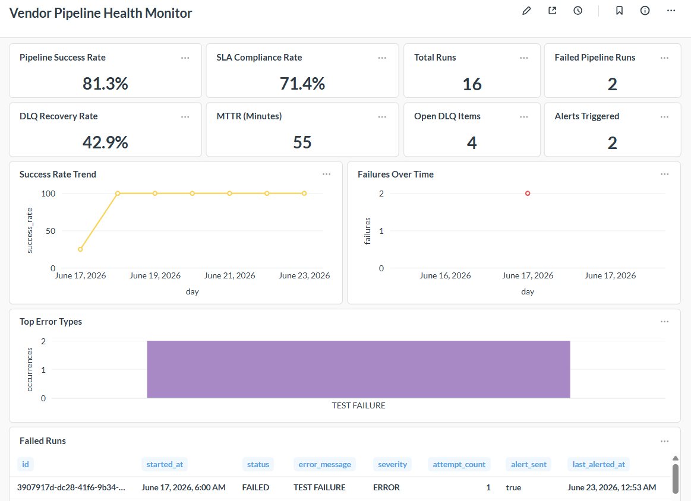
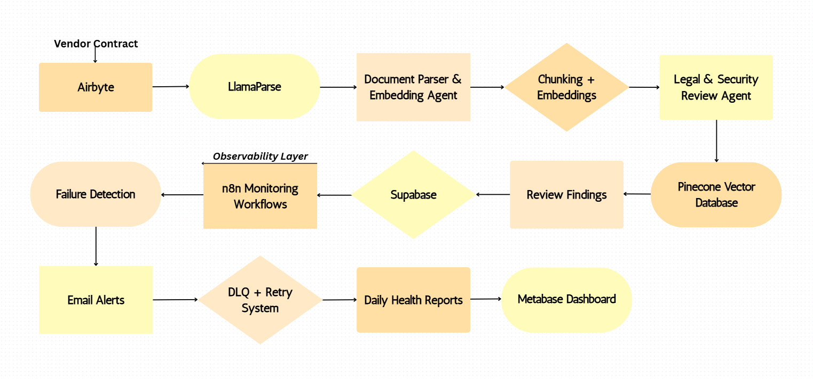
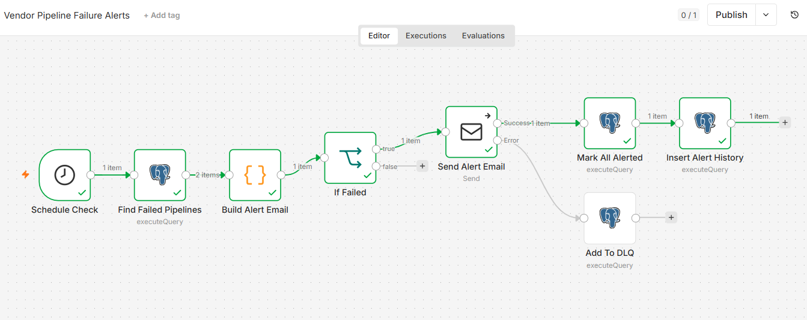

# Agentic Contract Analysis Platform with Observability

A production-style multi-agent system for automated contract review and risk analysis.

The platform ingests vendor agreements, performs early-stage deduplication to reduce cost and latency, parses documents into structured formats using LlamaParse, generates embeddings for retrieval with Pinecone, and runs specialized legal and security review agents.

An observability layer built with Supabase, n8n, and Metabase tracks workflow reliability, failure recovery, and operational performance in real time.

## Why This Matters

Most contract review workflows in real organizations are slow, expensive, and heavily manual. Large documents are repeatedly processed, parsed, and analyzed even when they haven’t changed, leading to wasted compute and unnecessary API costs.

This system addresses those inefficiencies by introducing early-stage deduplication, ensuring documents are only parsed and embedded when they are truly new or modified. It also adds structured observability, making system behavior measurable rather than opaque.

The result is a more cost-efficient, scalable, and production-aware AI workflow for document intelligence.

---

## Executive Dashboard



*End-to-end system architecture showing ingestion, parsing, embedding, agent execution, and observability workflow.*

### Results

* System Success Rate: 81%
* SLA Compliance Rate: 71.43%
* MTTR (Mean Time To Resolution): 55 minutes
* DLQ Recovery Rate: 42.9%
* Automated monitoring, alerting, retry workflows, and operational reporting

---

## Overview

This project demonstrates an end-to-end AI workflow for vendor contract review and compliance assessment.

The system:

* Ingests vendor contracts
* Early-stage deduplication to reduce compute and API costs
* Parses documents into structured markdown
* Chunks and embeds contract content
* Stores vectors in Pinecone
* Executes specialized review agents
* Produces structured findings
* Tracks operational health through monitoring, alerting, retries, and dashboard reporting

### Key Capabilities

* Multi-agent workflow orchestration with event-driven pipeline design
* Early file-hash deduplication (pre-parse cost optimization)
* Contract parsing and document processing
* Vector embeddings and retrieval
* Legal and security risk assessment
* Structured review findings
* Workflow observability and monitoring
* Automated alerting and retry mechanisms
* SLA and MTTR reporting

---

## Architecture



*End-to-end system architecture showing ingestion, parsing, embedding, agent execution, and observability workflow across Supabase, Pinecone, and n8n.*

### High-Level Flow

```text
Vendor Contract
      ↓
Airbyte
      ↓
LlamaParse
      ↓
Document Parser & Embedding Agent
      ↓
Chunking + Embeddings
      ↓
Pinecone Vector Database
      ↓
Legal & Security Review Agent
      ↓
Review Findings
      ↓
Supabase
      ↓
────────────────────────────
Observability Layer
────────────────────────────
      ↓
n8n Monitoring Workflows
      ↓
Failure Detection
      ↓
Email Alerts
      ↓
DLQ + Retry System
      ↓
Daily Health Reports
      ↓
Metabase Dashboard
```

---

## Workflow Stages

### 1. Contract Ingestion

The workflow begins when a new vendor contract is submitted.

Input data includes:

* Vendor ID
* Vendor Name
* Contract URL

Contract metadata is tracked and persisted across all workflow stages.

---

### 2. Document Parsing & Embedding Agent

This agent processes contracts into embeddings with early-stage deduplication to avoid redundant computation.

* Checks for existing documents in Supabase using a content hash
* Skips processing if a duplicate is found (prevents unnecessary parsing and embedding)
* Parses contracts using LlamaParse (for new documents only)
* Converts documents into structured markdown
* Splits content into semantic chunks
* Generates embeddings using Sentence Transformers
* Stores vectors in Pinecone

Each vector includes metadata such as vendor ID, document ID, and chunk index to support traceability and downstream retrieval.

---

### 3. Legal & Security Review Agent

This agent analyzes contract content for:

* Auto-renewal clauses
* Liability limitations
* Security controls
* Encryption requirements
* MFA requirements
* Compliance risks

Findings are stored in Supabase and linked to the originating document and workflow execution.

---

## n8n Workflow



*Automated monitoring and alerting workflow responsible for failure detection, retries, DLQ handling, and daily system health reporting.*

---

## Data Layer

### Supabase

Stores:

* Vendor records
* Documents
* Parsed documents
* Agent runs
* Review findings
* Pipeline monitoring data
* Alert history

### Pinecone

Stores vector embeddings used for semantic retrieval and future RAG workflows.

---

## Observability & Monitoring

A dedicated observability layer monitors workflow reliability and operational health.

### Monitoring Features

* Automated pipeline monitoring
* Failure detection
* Email alerting
* Dead Letter Queue (DLQ)
* Automated retry workflows
* Alert history tracking
* Daily health reporting
* Executive dashboarding

### Operational Metrics

Current monitoring includes:

* System Success Rate
* SLA Compliance Rate
* Mean Time To Resolution (MTTR)
* DLQ Recovery Rate
* Unresolved DLQ Tracking
* Failure Trends
* Alert History
* Retry History

---

## Technology Stack

### AI & Agent Frameworks

* LlamaIndex Workflows
* LlamaParse
* Groq (Llama 3.1)
* Sentence Transformers

### Data & Retrieval

* Supabase (PostgreSQL)
* Pinecone

### Workflow Automation

* Airbyte
* n8n

### Monitoring & Analytics

* Metabase

### Infrastructure

* Docker
* WSL2

---

## Key Concepts Demonstrated

### Multi-Agent Architecture

Independent agents perform specialized tasks and pass structured events between workflow stages.

### Cost-Aware Ingestion Design

The system minimizes expensive API usage by introducing early-stage deduplication:

- Prevents unnecessary LlamaParse calls
- Reduces compute + embedding cost
- Eliminates redundant vector storage
- Improves pipeline latency

### Retrieval-Augmented Generation (RAG)

Contracts are parsed, chunked, embedded, and stored for retrieval and downstream analysis.

### Observability Engineering

Workflow executions are monitored through logging, alerting, retry mechanisms, SLA tracking, and dashboard reporting.

### Production-Oriented Design

The system includes operational safeguards commonly found in production environments:

* Early-stage deduplication
* Alerting
* Retry workflows
* Dead Letter Queues
* Health reporting
* Incident tracking
* Reliability metrics

---

## Skills Demonstrated

* AI Agent Development
* Workflow Automation
* Retrieval-Augmented Generation (RAG)
* Vector Databases
* Contract Risk Analysis
* Prompt Engineering
* Data Modeling
* Observability Engineering
* Incident Monitoring
* SQL
* Docker
* API Integrations
* Low-Code / No-Code Orchestration
* Production Workflow Design

---

## Future Enhancements

* Additional specialist review agents
* Contract clause extraction
* Vendor risk scoring
* Approval workflows
* Human-in-the-loop review
* Contract comparison workflows
* Automated remediation recommendations
* Semantic contract search
